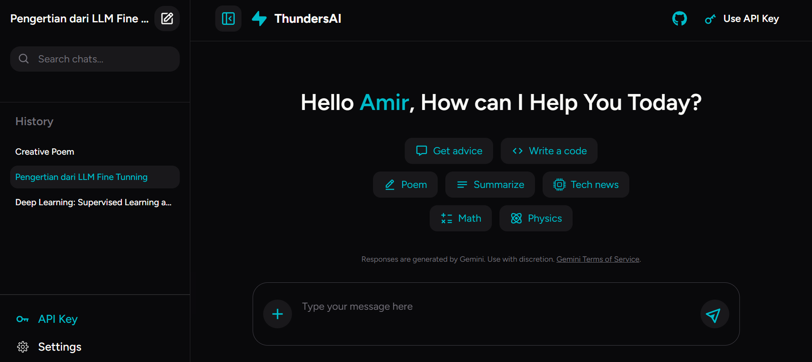

# Simple Chatbot Interface

A simple web-based chatbot interface powered by Google's Gemini LLM API. This project allows you to interact with an advanced language model in real-time.



## Features

- Modern and responsive user interface
- Real-time chat interaction
- Integration with Google's Gemini LLM API
- Easy to configure and extend

## Prerequisites

- Node.js (v16 or newer)
- PNPM package manager
- Gemini API key from Google AI Studio

## Installation

1. **Clone the repository**

   ```bash
   git clone https://github.com/AmirHamzah-1Fz/simple-chatbot-gemini-llm.git
   cd simple-chatbot-gemini-llm
   ```

2. **Install dependencies**

   ```bash
   pnpm install
   ```

3. **Configure API Key**

   - Copy `.env.example` to `.env.local`
   - Enter your Gemini API key in the provided variable
   - Get your API key at: https://aistudio.google.com/apikey

4. **Run the application**
   ```bash
   pnpm run dev
   ```

## Usage

- Open your browser at `http://localhost:3000`
- Start chatting by typing your message in the input field and press Enter/send
- The bot will respond to your message in real-time

## Contributing

1. Fork this repository
2. Create a feature branch (`git checkout -b new-feature`)
3. Commit your changes (`git commit -m 'Add new feature'`)
4. Push to the branch (`git push origin new-feature`)
5. Open a Pull Request

## License

This project is licensed under the Apache 2.0 License. See the LICENSE file for details.
